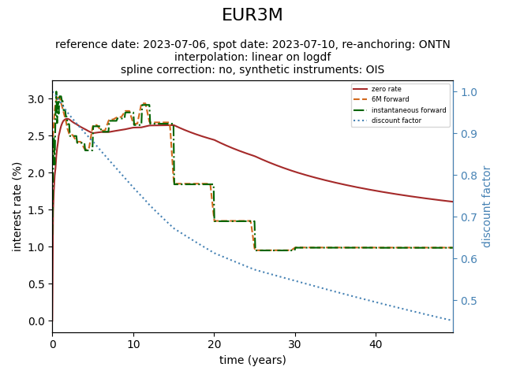

# pyratehike 
## Ramp up the quality of your interest rate curves

<!-- badges: start -->
[](https://github.com/spuddie/pyratehike/actions/workflows/check-code.yaml)
[](https://github.com/spuddie/pyratehike/actions/workflows/unit-tests.yaml)
<!-- badges: end -->

pyratehike is a package develop to bootstrap zero coupon curves, in
particular IBOR curves and OIS curves. It was created as part of a
master's thesis project, check out the 
[vignette](MastersThesis.md)
for more details. This
thesis contains all the details on the implementation. The package is
also reasonably documented.

## R vs python
An R implementation also exists, more info on the creation history
and the difference can be found in 
[R-vs-python.md](R-vs-python.md).

## Installation
To install the package use the command `pip install
git+https://github.com/spuddie/pyratehike`.

## Example session
```python
from pyratehike import IRCurve, ListOfInstruments, RHSettings, roundtrip

settings_ois = RHSettings(
    today_date = "2023-07-06",
    interpolation_data_type = "logdf",
    interpolation_method = "linear",
    currency = "EUR",
)
list_ois = ListOfInstruments(settings_ois, "data/ois.csv")
curve_ois = IRCurve("ESTR", settings_ois)
curve_ois.bootstrap(list_ois.instruments)

settings_ibor = RHSettings(
    today_date = "2023-07-06",
    interpolation_data_type = "logdf",
    interpolation_method = "linear",
    currency = "EUR",
    synthetic_instruments = "OIS",
    re_anchoring = "ONTN",
)
curve_ibor = IRCurve("EUR3M", settings_ibor)
curve_ibor.set_discount_curve(curve_ois)
list_ibor = ListOfInstruments(
    settings_ibor, 'data/ibor.csv', curve_ois
)
curve_ibor.bootstrap(list_ibor.instruments)
curve_ibor.re_anchor(list_ois.instruments[0])

[str(d) for d in curve_ibor.get_dates()]
```
['2023-07-06', '2023-07-07', '2023-07-10', '2023-07-11', '2023-07-17', '2023-07-24', '2023-08-10', '2023-09-11', '2023-10-10', '2023-11-15', '2023-12-20', '2024-01-17', '2024-02-21', '2024-03-20', '2024-04-17', '2024-05-15', '2024-08-21', '2024-11-20', '2025-02-19', '2025-05-21', '2025-08-20', '2026-07-10', '2027-07-12', '2028-07-10', '2029-07-10', '2030-07-10', '2031-07-10', '2032-07-12', '2033-07-11', '2034-07-10', '2035-07-10', '2038-07-12', '2043-07-10', '2048-07-10', '2053-07-10', '2063-07-10', '2073-07-10']
```python
[curve_ibor.get_time(p) for p in range(curve_ibor.n_pillars)]
```
[0.0, 0.0027397260273972603, 0.010958904109589041, 0.0136986301369863, 0.030136986301369864, 0.049315068493150684, 0.0958904109589041, 0.18356164383561643, 0.26301369863013696, 0.36164383561643837, 0.4575342465753425, 0.5342465753424658, 0.6301369863013698, 0.7068493150684931, 0.7835616438356164, 0.8602739726027397, 1.1287671232876713, 1.378082191780822, 1.6273972602739726, 1.8767123287671232, 2.126027397260274, 3.0136986301369864, 4.019178082191781, 5.016438356164383, 6.016438356164383, 7.016438356164383, 8.016438356164384, 9.024657534246575, 10.021917808219179, 11.01917808219178, 12.01917808219178, 15.027397260273972, 20.024657534246575, 25.03013698630137, 30.03287671232877, 40.038356164383565, 50.04657534246575]
```python
curve_ibor.get_discount_factors()
```
[1.0, 0.9999682508655688, 0.999873012533767, 0.9998411969333404, 0.9996410809684033, 0.9994037178210212, 0.9986097329872896, 0.9968663400805241, 0.9949066786448703, 0.9928411958056559, 0.990202106126782, 0.9878552521232858, 0.9853319117069905, 0.9830997519637001, 0.9806515789509863, 0.9785516114649598, 0.9706258493221342, 0.9634807557123317, 0.956676761492, 0.950132888484041, 0.9438667126801402, 0.9232071691065842, 0.9011846196288226, 0.880760700110624, 0.8579458740459891, 0.8363397699674789, 0.8140745809378699, 0.7919752593358786, 0.7700785109946883, 0.7500552038025673, 0.7285235359255507, 0.6725167605165123, 0.6134141307637547, 0.5735524044526304, 0.5469840081097844, 0.4956352057800904, 0.44915534840828175]
```python
curve_ibor.get_zero_rates()
```
[0, 0.011588618032642115, 0.011588342096431909, 0.011593544435722435, 0.011911723848527725, 0.012094883858502303, 0.014508586590032293, 0.017098234945150097, 0.019414717010515753, 0.019866373150904063, 0.02152015758312483, 0.022871644816014895, 0.023450025457401262, 0.02411360744943417, 0.02493492620915501, 0.02520330584725521, 0.026413074440640307, 0.026996041936167357, 0.027215055568280022, 0.027256932653623948, 0.027172893949855986, 0.026512809530025258, 0.025887167721331112, 0.025310649500175413, 0.02546594118919993, 0.02547165897951127, 0.02566018539202407, 0.025843099860894565, 0.02606914285279627, 0.026100718941571403, 0.026352496345745168, 0.026400329893743805, 0.0244056603688121, 0.022209465746808814, 0.020089174886498886, 0.01753106676471244, 0.01599283183827245]
```python
roundtrip(curve_ibor, list_ibor.market_instruments)
```
[-4.85722573273506e-17, -1.5959455978986625e-16, 3.400058012914542e-16, 7.73686670285656e-16, 1.5959455978986625e-16, -7.28583859910259e-17, -2.949029909160572e-16, 1.700029006457271e-16, 1.0755285551056204e-16, 3.469446951953614e-17, 2.498001805406602e-16, -8.673617379884035e-16, 2.5326962749261384e-16, 0.0, -1.5612511283791264e-16, 0.0, -3.469446951953614e-18, -6.938893903907228e-18, 4.163336342344337e-17, 3.122502256758253e-17, 2.42861286636753e-17, 0.0, 6.938893903907228e-18, -4.753142324176451e-16, 1.0408340855860843e-17, -1.9532986339498848e-15, -1.2614909117303341e-14, -6.938893903907228e-18, -1.3877787807814457e-17]
```python
curve_ibor.plot()
```

