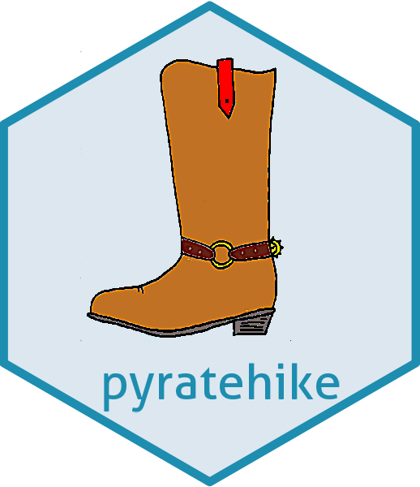

# pyratehike 
## Ramp up the quality of your interest rate curves

<!-- badges: start -->

<!-- badges: end -->

pyratehike is a package develop to bootstrap zero coupon curves, in
particular IBOR curves and OIS curves. It was created as part of a
master's thesis project, check out the 
[vignette](MastersThesis.md)
for more details. This
thesis contains all the details on the implementation. The package is
also reasonably documented.

## R vs python
An R implementation also exists, more info on the creation history
and the difference can be found in 
[R-vs-python.md](R-vs-python.md).

## Installation
To install the package use the command `pip install
git+https://github.com/spuddie/pyratehike`.
